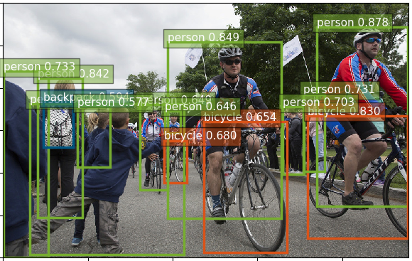

# RetinaNet
Implementation of RetinaNet (this is converted from [maskrcnn-benchmark](https://github.com/facebookresearch/maskrcnn-benchmark))

<p align="center"></p>

## Environment

- Python 3.6
- PyTorch 1.1
- OpenCV

## Performance

|         Model          | maskrcnn |                          converted                           | train(TODO) |
| :--------------------: | :------: | :----------------------------------------------------------: | :---------: |
| RetinaNet_R-50-FPN_1x  |   36.3   | [36.3](https://drive.google.com/open?id=1edT78Boy6SA3EdSKvJB9sR72KShSIg2e) |             |
| RetinaNet_R-101-FPN_1x |   38.5   | [38.5](https://drive.google.com/open?id=1Qrwx4PaxQJHnV_R2H8HV8QK0P6IyTi9a) |             |

## Demo

```shell
$ cd scripts
$ python demo.py [--config-file ../configs/retina_resnet50_v1b_coco.yaml] [--images ../png/biking.jpg]
```

## Eval

```shell
$ cd scripts
$ python eval.py [--config-file ../configs/retina_resnet50_v1b_coco.yaml]
```

## Train

```shell
$ cd scripts
$ export NGPUS=4
$ python -m torch.distributed.launch --nproc_per_node=$NGPUS train.py [--config-file ../configs/retina_resnet50_v1b_coco.yaml] [--skip-test false]
```

> You can modify training and test setting in `configs/xxx.yaml` and `configs/defaults.py` 


## TODO

- [ ] Add freeze backbone
- [ ] Add training results